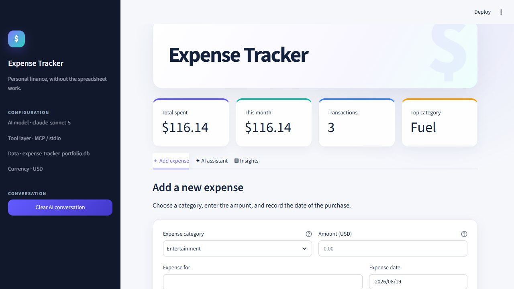
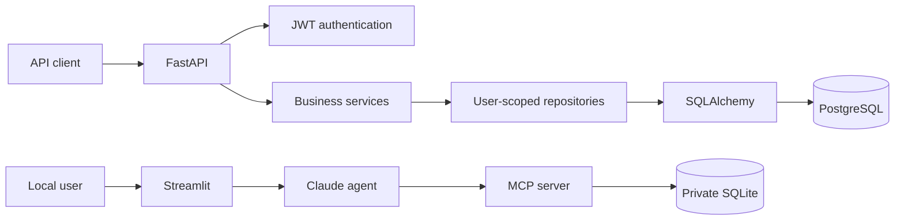

# Expense Tracker Platform

[](https://github.com/PranaPragada7/Expense_Tracker/actions/workflows/ci.yml)


An authenticated expense-management API and local AI assistant. The production
backend provides user-isolated financial data, PostgreSQL migrations, analytics,
idempotent writes, and structured operational signals. The original Streamlit
and MCP workflow remains available as a private, single-user AI demonstration.



## Engineering signals

- FastAPI endpoints with explicit Pydantic request and response contracts
- Argon2 password hashing and expiring JWT bearer authentication
- Authorization enforced through user-scoped repository queries
- PostgreSQL and SQLite support through SQLAlchemy 2
- Auditable Alembic migrations and automated migration-drift detection
- Decimal-backed currency values instead of floating-point persistence
- Pagination, date/category/search filters, and monthly aggregation
- Idempotency keys that prevent duplicate expense creation during retries
- Structured request logs, correlation IDs, liveness, and database readiness
- Non-root containers and a locally bound Docker Compose environment
- Offline API tests plus migration-backed PostgreSQL integration tests in CI
- Direct Claude tool use through an 18-tool MCP server for the local assistant

## Architecture



The API path is the production-style, multi-user boundary. Authentication is
resolved before business logic, and every category and expense query is scoped
to the authenticated user. The local AI path is deliberately private and can be
run without exposing personal financial records as a public service.

## API capabilities

| Area | Endpoint | Behavior |
|---|---|---|
| Health | `GET /health/live` | Process liveness |
| Health | `GET /health/ready` | Database readiness |
| Accounts | `POST /api/v1/auth/register` | Create an Argon2-protected account |
| Accounts | `POST /api/v1/auth/token` | Issue a short-lived bearer token |
| Accounts | `GET /api/v1/me` | Read the current identity |
| Categories | `GET/POST /api/v1/categories` | Manage user-owned categories |
| Expenses | `GET/POST /api/v1/expenses` | Paginated, filtered workflows |
| Expenses | `GET/PATCH/DELETE /api/v1/expenses/{id}` | Isolated lifecycle operations |
| Analytics | `GET /api/v1/analytics/monthly` | Category-level monthly totals |

Send an `Idempotency-Key` header when creating an expense. Repeating the same
request with that key returns the previously created record and identifies the
response with `X-Idempotent-Replay: true`.

## Run the API locally

Requirements: Python 3.11 or newer.

```powershell
python -m venv .venv
.\.venv\Scripts\Activate.ps1
python -m pip install -r requirements-dev.txt
Copy-Item .env.example .env
python -m alembic upgrade head
python -m uvicorn expense_tracker.api:app --reload
```

On macOS or Linux, activate the environment with:

```bash
source .venv/bin/activate
```

The default API database is the ignored local file `expense_api.db`. Open
[http://127.0.0.1:8000/docs](http://127.0.0.1:8000/docs) for the interactive
OpenAPI documentation.

For local PostgreSQL and the API container:

```powershell
docker compose up --build
```

The compose file binds the API only to `127.0.0.1:8000`; it does not deploy or
publish anything to a cloud provider. Stop the stack with `docker compose down`.
Add `--volumes` only when you intentionally want to delete the local PostgreSQL
data volume.

## Example API workflow

Register an account:

```powershell
$account = @{
  email = "developer@example.test"
  password = "choose-a-long-local-password"
  display_name = "Developer"
} | ConvertTo-Json

Invoke-RestMethod `
  -Method Post `
  -Uri http://127.0.0.1:8000/api/v1/auth/register `
  -ContentType application/json `
  -Body $account
```

The generated OpenAPI interface provides authenticated examples for the
remaining endpoints without requiring a separate REST client.

## Run the local AI assistant

The private assistant requires an Anthropic API key. Set `ANTHROPIC_API_KEY` in
`.env`, initialize its separate local demonstration database, and launch the UI:

```powershell
python db_setup.py
streamlit run streamlit_app.py
```

The MCP server uses stdio and starts automatically when the assistant connects.
Manual entry and spending insights work locally; assistant requests require an
available Anthropic account and quota.

### MCP tool inventory

- Category management: `list_categories`, `add_category`, `rename_category`,
  `delete_category`, `get_category_name`
- Expense management: `add_expense`, `update_expense`, `delete_expense`,
  `list_expenses`, `search_expenses`, `expenses_by_category`,
  `total_expense_by_category`, `total_expense`, `monthly_summary`
- Supporting queries: `current_date`, `find_category`, `get_expense`,
  `expenses_between`

## Validation

Run the same core checks used in CI:

```powershell
python -m black --check .
python -m ruff check .
python -m compileall -q agent.py client_test.py db_setup.py mcp_client.py server.py streamlit_app.py expense_tracker migrations
python -m pytest -q
python client_test.py
python -m alembic check
```

CI tests Python 3.11, 3.12, and 3.13. A separate infrastructure job starts
PostgreSQL, applies every migration, checks schema drift, exercises an
authenticated expense round trip, validates Compose, and builds the API image.

## Project structure

| Path | Purpose |
|---|---|
| `expense_tracker/api.py` | HTTP routes, dependencies, health, request context |
| `expense_tracker/models.py` | User, category, and expense relational models |
| `expense_tracker/repositories.py` | Authenticated user-scoped persistence |
| `expense_tracker/services.py` | Transactions and business rules |
| `expense_tracker/security.py` | Argon2 and JWT primitives |
| `expense_tracker/schemas.py` | Validated API contracts |
| `migrations/` | Versioned PostgreSQL and SQLite schema changes |
| `compose.yaml` | Local API and PostgreSQL environment |
| `streamlit_app.py` | Private single-user interface |
| `agent.py` | Direct Claude tool-calling loop |
| `server.py` | Local SQLite operations exposed as MCP tools |
| `tests/` | API, authorization, MCP, database, and UI checks |

## Configuration

| Variable | Required | Default | Purpose |
|---|---:|---|---|
| `DATABASE_URL` | No | `sqlite:///./expense_api.db` | API persistence |
| `JWT_SECRET` | Production | Local development value | Bearer-token signing |
| `ACCESS_TOKEN_MINUTES` | No | `60` | Token lifetime |
| `APP_ENV` | No | `development` | Runtime safety mode |
| `LOG_LEVEL` | No | `INFO` | Structured log threshold |
| `ANTHROPIC_API_KEY` | AI assistant | None | Claude authentication |
| `ANTHROPIC_MODEL` | No | `claude-sonnet-5` | Assistant model |
| `EXPENSE_DB` | No | `expenses.db` | Private MCP demo storage |

Production mode refuses to start with the built-in development JWT secret.
Secrets, tokens, local databases, and personal expense records are excluded from
Git.

## Security scope

The API demonstrates application security controls but has not undergone an
independent security audit. It does not connect to banks, process payments, or
provide financial advice. Use generated secrets, TLS, rate limiting at the edge,
managed backups, and an external security review before handling real sensitive
data in a shared environment.

See [`CHANGELOG.md`](CHANGELOG.md) for release history and
[`CONTRIBUTING.md`](CONTRIBUTING.md) for contribution guidance.
