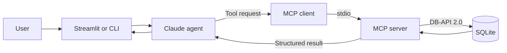

# Expense Tracker Agent

[](https://github.com/PranaPragada7/Expense_Tracker/actions/workflows/ci.yml)


An AI-powered personal expense tracker that turns natural-language requests
into structured database operations. The project combines a responsive
Streamlit interface, Claude tool use, an MCP server, and local SQLite storage.


## What this project demonstrates

- Agentic, multi-step tool use for real database workflows
- A clean separation between the language model, MCP transport, and data layer
- A direct Claude tool-calling loop without an orchestration framework
- Input validation, scoped assistant behavior, and safe local data handling
- Automated smoke tests and continuous integration
- A responsive user interface for entry, conversation, and spending insights

## Product features

- Add expenses through a form or a natural-language request
- Store the date, amount, category, and description for each transaction
- Search, update, delete, and summarize expenses through MCP tools
- Review totals, recent transactions, and category-level spending
- Ask the focused financial assistant for database-backed insights
- Keep expense data local in a SQLite file

## Architecture



Claude never accesses SQLite directly. It selects from the MCP tool schemas,
and the server owns every validated database read and write.

### Example agent workflows

| User intent | Tool sequence |
|---|---|
| Add a lunch expense | `find_category` → `add_expense` |
| Change yesterday's gas amount | `search_expenses` → `update_expense` |
| Delete a matching purchase | `search_expenses` → `delete_expense` |
| Review monthly spending | `monthly_summary` |

## Technology

| Layer | Technology |
|---|---|
| Interface | Streamlit, pandas |
| Language model | Anthropic Claude |
| Agent integration | Direct Messages API tool-use loop |
| Tool protocol | Model Context Protocol over stdio |
| Data | SQLite through Python DB-API 2.0 |
| Quality | pytest, Black, GitHub Actions |

## Quick start

Requirements:

- Python 3.11 or newer
- An Anthropic API key for the assistant

Create and activate a virtual environment:

```powershell
python -m venv .venv
.\.venv\Scripts\Activate.ps1
python -m pip install -r requirements.txt
```

For macOS or Linux, activate the environment with:

```bash
source .venv/bin/activate
```

Create a local environment file and add `ANTHROPIC_API_KEY`:

```powershell
Copy-Item .env.example .env
```

Create the database schema and starter categories, then launch the app:

```powershell
python db_setup.py
streamlit run streamlit_app.py
```

The MCP server uses stdio and starts automatically when a client connects.

## Quality checks

Install development dependencies and run the same checks used in CI:

```powershell
python -m pip install -r requirements-dev.txt
python -m black --check .
python -m ruff check .
python -m compileall -q agent.py client_test.py db_setup.py mcp_client.py server.py streamlit_app.py
python -m pytest -q
python client_test.py
```

`client_test.py` exercises all 18 MCP tools and removes its temporary records
when the smoke test finishes. Direct tests enforce at least 80% coverage across
the agent, database, MCP client/server, and interface modules.

## MCP tools

The server exposes 18 tools:

- Category management: `list_categories`, `add_category`, `rename_category`,
  `delete_category`, `get_category_name`
- Expense management: `add_expense`, `update_expense`, `delete_expense`,
  `list_expenses`, `search_expenses`, `expenses_by_category`,
  `total_expense_by_category`, `total_expense`, `monthly_summary`
- Supporting queries: `current_date`, `find_category`, `get_expense`,
  `expenses_between`

## Project structure

| Path | Purpose |
|---|---|
| `streamlit_app.py` | Form, assistant, and insights interface |
| `agent.py` | Claude tool-calling loop and command-line interface |
| `server.py` | Validated SQLite operations exposed as MCP tools |
| `mcp_client.py` | Reusable stdio MCP client |
| `db_setup.py` | Schema and starter-category initialization |
| `client_test.py` | End-to-end MCP tool smoke test |
| `tests/` | Automated database and UI checks |
| `.github/workflows/ci.yml` | Continuous-integration pipeline |

## Configuration

| Variable | Required | Default |
|---|---:|---|
| `ANTHROPIC_API_KEY` | Yes | — |
| `ANTHROPIC_MODEL` | No | `claude-sonnet-5` |
| `AGENT_EFFORT` | No | `medium` |
| `EXPENSE_DB` | No | `expenses.db` beside the source files |

The `.env` file and `expenses.db` are excluded from Git. API keys and personal
expense data stay outside the repository.

## Deployment notes

- SQLite is ideal for a local demonstration or a single-user deployment. A
  shared multi-user service should use authenticated users and a server database.
- The app launches the MCP server as a local child process, so the host must
  support Python subprocesses and writable local storage.
- Assistant features require a valid Anthropic key, available quota, and network
  access. Manual entry and insights remain local database workflows.
- The assistant provides general educational finance information, not financial
  advice, account access, or bank integrations.

To recreate the database with an empty expenses table:

```powershell
python db_setup.py --reset
```

See [`CHANGELOG.md`](CHANGELOG.md) for release history and
[`CONTRIBUTING.md`](CONTRIBUTING.md) for contribution guidelines.
